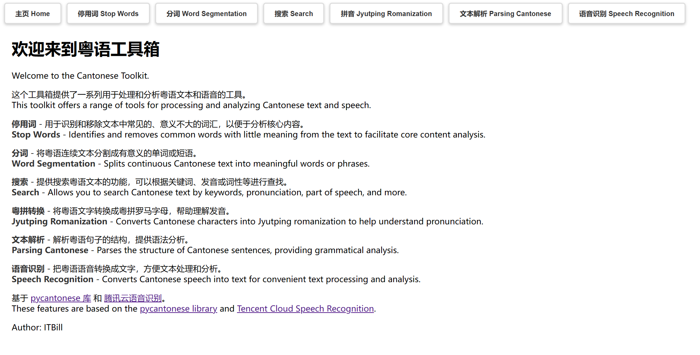
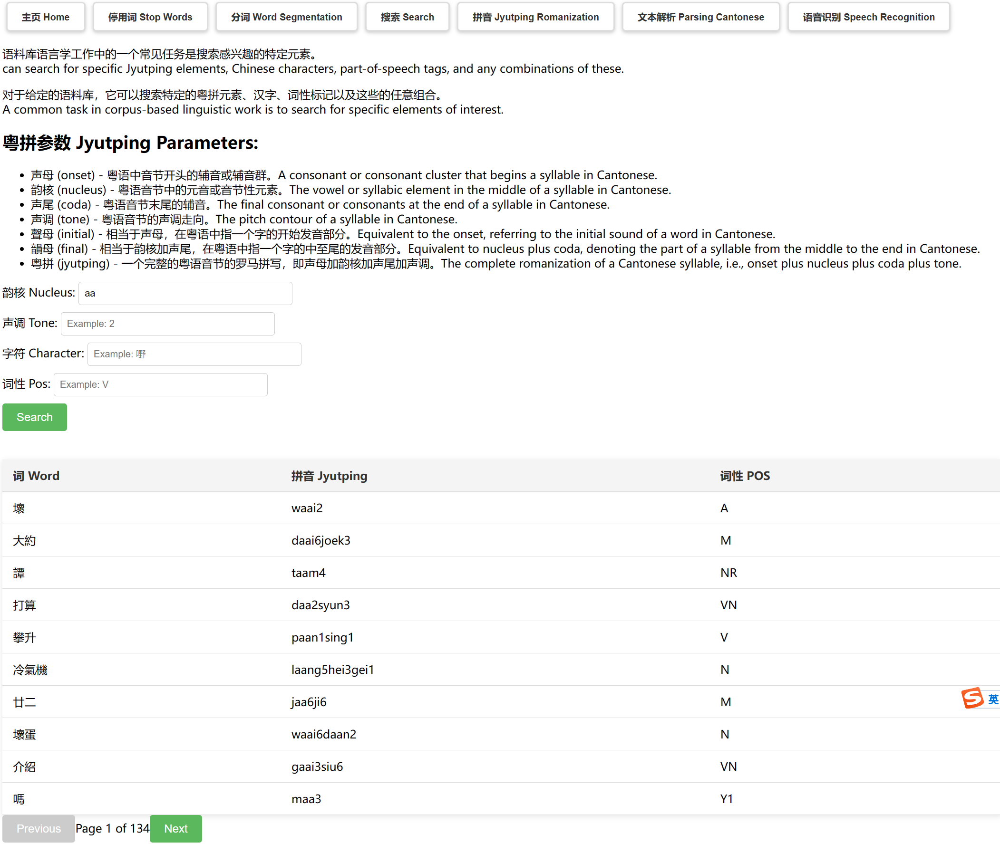
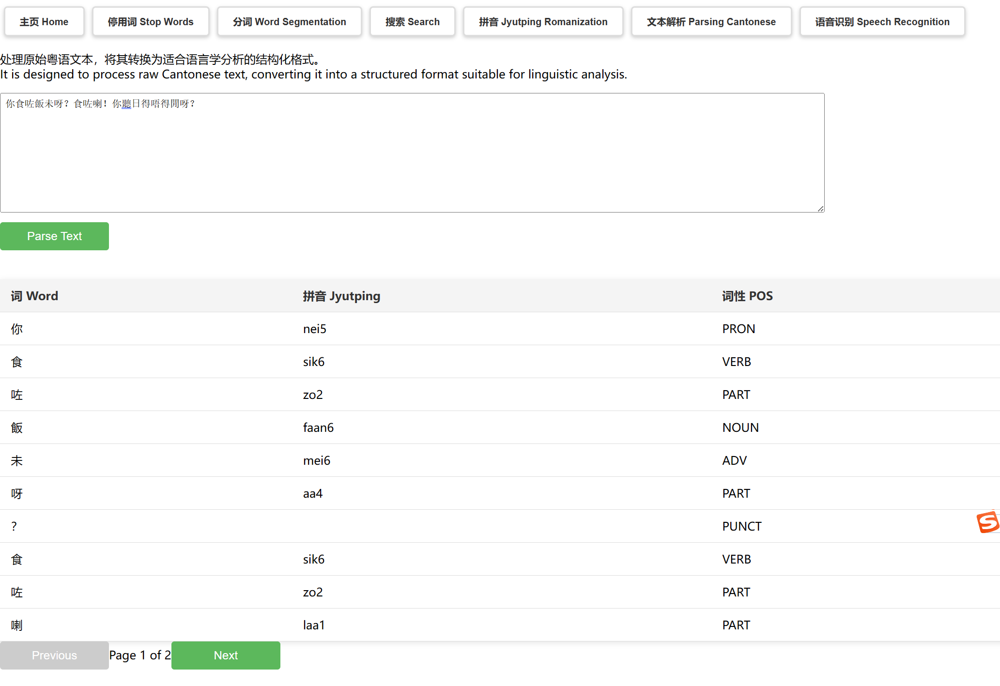

[toc]

# 粤语工具箱 Cantonese Toolbox

12110817 张展玮

## 效果展示

### 主页



### 停用词


### 分词


### 搜索



### 拼音


### 文本解析



### 语音识别


## 后端配置

### 安装依赖

```bash
pip install -r requirements.txt
```
加速可使用
```bash
pip install -r requirements.txt -i https://mirrors.tencent.com/pypi/simple/
```

### 运行
```bash
python main.py
```
默认运行在8090端口


## 前端配置

这个配置指南将帮助你从零开始设置并运行Yarn项目，确保环境配置的一致性，以便于评估。

### 环境需求

- Node.js：请安装最新的稳定版本的Node.js。
- Yarn：这个项目使用Yarn作为包管理器。

### 安装步骤

#### 1. 安装Node.js

请访问[Node.js官网](https://nodejs.org/)下载并安装Node.js。安装完成后，你可以在命令行中运行以下命令以确认安装成功：

```bash
node --version
```

#### 2. 安装Yarn

通过以下命令安装Yarn：

```bash
npm install --global yarn
```

安装完成后，通过运行以下命令来验证Yarn是否正确安装：

```bash
yarn --version
```

#### 3. 安装项目依赖

进入项目目录并安装依赖：

```bash
cd [前端项目目录，如frontent]
yarn install
```

#### 4. 运行开发服务器

为了在本地启动开发服务器，请运行：

```bash
yarn serve
```

然后会出现

```bash
  App running at:
  - Local:   http://localhost:8080/
  - Network: http://10.24.118.137:8080/
```

在浏览器中打开 http://localhost:8080/ 即可。（注意后端也需要启动，否则功能无法使用）
